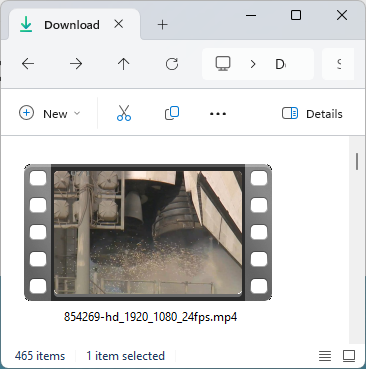
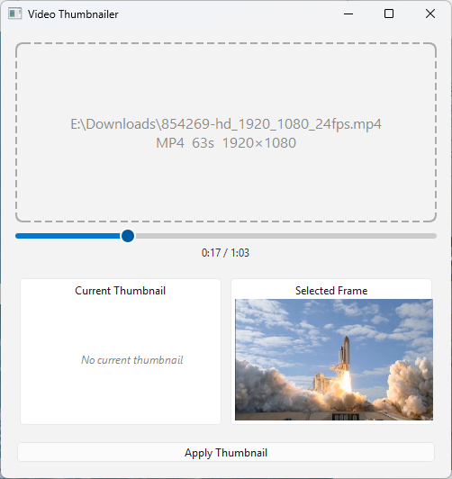
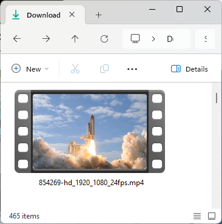

# video-thumbnailer

Many video players and file managers generate a thumbnail by grabbing the first frame of the video — which is often a black screen, a title card, or a fade-in. This tool lets you scrub to any frame you like and embed it as the video's cover art, so the thumbnail actually shows something meaningful.

Built with Python 3.13, PySide6 (Qt6), and PyAV.

**Supported formats:** MP4, MOV, MKV, WebM, AVI, FLV

---

## What it looks like

### Before (original thumbnail)



### Application



### After (updated thumbnail)



---

## Quick start

```bash
python3.13 -m venv .venv
source .venv/bin/activate        # Linux / macOS
# .venv\Scripts\activate         # Windows
pip install -e ".[dev]"
video-thumbnailer
```

---

## Requirements

- Python 3.13+
- [uv](https://github.com/astral-sh/uv) or `pip` (for environment setup)

---

## Setup

### Create and activate a virtual environment

```bash
python3.13 -m venv .venv
source .venv/bin/activate        # Linux / macOS
# .venv\Scripts\activate         # Windows
```

### Install dependencies

```bash
pip install -e ".[dev]"
```

This installs the application along with all development tools (pytest, ruff, mypy, pyinstaller).

---

## Running the application

```bash
video-thumbnailer
```

Or directly via the module:

```bash
python -m video_thumbnailer.app
```

Typical workflow:

1. Open a video file.
2. Scrub the timeline to the frame you want.
3. Apply/save the thumbnail.

---

## Running tests

All tests are under `tests/`. Activate the virtual environment first.

### Run unit and integration tests

```bash
pytest tests/unit/ tests/integration/ -q
```

### Run with coverage (≥80% gate)

```bash
pytest --cov=video_thumbnailer \
       --cov-report=term-missing \
       --cov-fail-under=80 \
       tests/unit/ tests/integration/
```

### Run benchmarks

```bash
pytest tests/benchmarks/ --benchmark-only
```

### Via Makefile

```bash
make test        # unit + integration tests
make coverage    # tests with >=80% coverage gate
make lint        # ruff linter
make typecheck   # mypy --strict
```

---

## Building a distribution

Single-file executables are produced via [PyInstaller](https://pyinstaller.org).

```bash
make dist-linux    # → dist/linux/video-thumbnailer
make dist-macos    # → dist/macos/video-thumbnailer.app
make dist-windows  # → dist/windows/video-thumbnailer.exe
```

Or manually:

```bash
pyinstaller pyinstaller.spec --distpath dist/linux --workpath build/linux --noconfirm
```

---

## Project structure

```
src/
  video_thumbnailer/
    app.py          # Entry point
    models.py       # VideoFile, VideoFormat, TimelinePosition
    exceptions.py   # Domain exceptions
    core/           # Video loading, frame extraction, thumbnail writing
    platform/       # OS-specific cache invalidation (Linux, macOS, Windows)
    ui/             # PySide6 widgets (MainWindow, TimelineWidget, workers)
tests/
  unit/             # Unit tests
  integration/      # Integration tests (real video files via PyAV)
  benchmarks/       # pytest-benchmark frame extraction perf tests
```

---

## Code quality

```bash
ruff check src/ tests/    # linting
mypy --strict src/         # type checking
```
